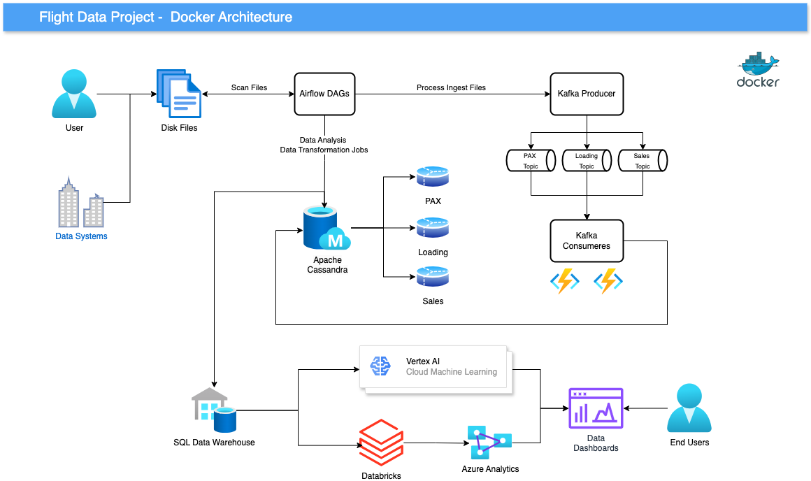

# airline-data-engineering

### Project Overview

The Airline project is a comprehensive data engineering solution designed to process nightly batch pipelines for sales, passenger (pax), and loading data from the fictional AirBharat airline. 

Implemented on Docker infrastructure, this project integrates multiple components such as Apache Kafka for real-time data streaming, Apache Airflow for managing batch data pipelines, and Apache Cassandra for scalable time-series data storage. 

The system supports data scientists and analysts by delivering clean, structured data, facilitating predictive modeling for in-flight food consumption and providing visual analytics dashboards. The solution leverages Docker to ensure seamless orchestration and scalability across all services.

### Development Environemnt Setup

Setup virtual environment for the project. I prefer `pyenv` but you can use tool of your choice.

#### Pyenv (Virtual env setup)
For `pyenv` execute below commands in project root directory,

```
pyenv install 3.11.9
pyenv virtualenv 3.11.9 airline-data-engineering
pyenv local airline-data-engineering
```

#### Poetry (Dependency/Package Manager)

We are using `poetry` python dependency manager for sake of easiness.
```
pip install poetry
poetry install
```

### Docker / Docker Compose Setup

**IMPORTANT NOTE:** Make sure your docker desktop resource setup is setup to minimum,
- **CPU:** 4 (or more)
- **Memory:** 16 GB  RAM (or more)
- **Swap:** 2 GB (or more)
- **Virtual disk limit:** 250 GB (or more)

We leverage Docker to for required software service dependencies for our project. We spin up below services via `docker-compose.yml`,

- Apache Kafka
- Apache Airflow
- Cassandra
- Redis
- Postgres

Execute below commands from our project root directory,

**Step 1:** Generate custom Apache Airflow docker image
```
docker compose build
```

**Step 2:** (Optional) Cleanup any non intermediate temporary not-required docker images generated during build process
```
docker system prune -f
```

**Step 3:** Start docker services
```
docker compose up -d
```

**Step 4:** Start consumers (From project root directory)
```
python src/consumer/pax_kafka_python_consumer.py
python src/consumer/loading_kafka_python_consumer.py
```

**Step 5:** (Optional) Destroy docker services

To shutdown docker services, and presist data without removing volumes.
```
docker compose down
```
To shutdown docker services and remove volume storage.
```
docker compose down -v
```

### System Monitoring Dashboards

- Apache Airflow: [http://localhost:8080/](http://localhost:8080/)
- Apache Kafka Control Center: [http://localhost:9021/](http://localhost:9021/)


## Architecture

The architecture of the Airline project is built on a distributed system using **Docker** to manage various interconnected services. Key components like `Apache Kafka`, `Apache Airflow`, `Cassandra`, `Postgres`, and Redis are deployed in isolated containers using `Docker` Compose, enabling seamless interaction while maintaining independence. **Kafka** handles real-time data streaming for flight-related events, while Airflow orchestrates the data pipelines for ingestion and processing. **Cassandra** stores large volumes of time-series flight data, and Postgres manages structured data. **Redis** serves as a high-speed cache to optimize operations. This architecture allows for efficient data processing and scaling, all running locally within **Docker**, making **development, testing,** and **orchestration streamlined**.

We selected these components for the **Airline project** to meet the demands of **real-time data processing, scalability, and orchestration**. **Apache Kafka** was chosen for its ability to handle **high-throughput, real-time data streams, which are critical for capturing flight events**. Apache Airflow enables us to **orchestrate and automate complex data pipelines with dependency management**. **Cassandra** offers **scalability** and efficient **handling of time-series data**, making it ideal for storing flight-related metrics. **Postgres** provides a robust relational database for structured data, and **Redis** enhances system performance by offering **high-speed caching**. Together, these components provide a **flexible, scalable, and reliable infrastructure** for the project.

**NOTE**: This project is built on a local Docker infrastructure, and the environment setup is shown in the proposed diagram below.

#### Docker Supported Architecture



## Application Components
To showcase capabilities of different Data Engineering tools and technologies, below is what describes our interconnected application components,

#### 1. Apache Airflow DAGs:
Airflow DAGs are used to orchestrate and automate batch processing pipelines. These DAGs manage data ingestion, transformation, and movement within your project, allowing tasks to be scheduled and executed in a sequence based on dependencies.

#### 2. Kafka Topics:
Kafka topics capture real-time streams of flight-related data (e.g., passenger and loading data). Each topic handles specific types of events, such as passenger counts and load information, and queues messages for consumers to process.

#### 3. Kafka Consumers:
Kafka consumers in this project are responsible for processing messages from Kafka topics. They read the streamed flight data in real-time and perform the necessary operations like data validation and transformation before passing it to storage systems or further processing pipelines.

#### 4. Apache Cassandra Database:
The Cassandra database stores time-series flight data, such as historical rates and live event data for various metrics. It is designed to handle the large volume of real-time data streams produced by Kafka topics and provides a robust, scalable backend for querying flight data analytics.

#### 5. Postgres and Redis:
Postgres is used for persistent storage of structured data, while Redis supports high-speed caching mechanisms to accelerate data processing tasks that involve repetitive data retrieval.

#### 6. Docker Compose:
Docker Compose is used to manage and run all the required services, such as Kafka, Airflow, Cassandra, Redis, and Postgres, in isolated containers. This setup ensures that the entire system can be spun up and managed with minimal manual configuration, allowing for easy development and testing in a consistent environment.

## Data Structure

This project is designed to extract, transform, and load flight data from **nightly batch** updates and **data streams** from various data sources, transform the data and insert them into a **Cassandra** database to create a **denormalized fact table** for data scientists and **dimension tables** for data analysts to build information useful for business. 

The fact table can be used for various **data science analyses**, including passenger load analysis, operational efficiency, and pricing trends.

More information about data structure used can be found in  [Data Description](data/README.md)

## Data Science & Analysis:

### Potential use cases

**1. Flight Load Analysis:** Analyze how passenger boarding (`boarded_y`) compares with aircraft physical capacity (`capacity_physical_y`) and saleable capacity (`capacity_saleable_y`).

**2. Price Elasticity:** Analyze how the price of tickets (`price`) influences the number of passengers boarding.

**3. Operational Efficiency:** Analyze how different `aircraft_type` and `booking_class_cbase` impact the number of passengers and total capacity usage.

**4. Time-based Trends:** Analyze trends in flight data across months (`flight_month_year`) and years (`flight_year`) to determine seasonal demand patterns for different airlines.

### Future Implementation

To create a data science fact table from the pax and loading tables in Cassandra, we can look at how the two tables are related. The main relationship between the tables lies in the fact that both tables contain flight-related data, where flight_date, airline, and flight_number are common keys.

Since Cassandra does not support traditional SQL-style joins directly (because it is designed for distributed storage and horizontal scaling), we typically handle joins at the application level (in code), or we denormalize the data to build a fact table.

#### Key Points for Fact Table Construction:
- **pax table** contains passenger-related data, like the number of passengers who boarded, physical capacity, and saleable capacity.
- **loading table** contains detailed flight-related data, including departure/arrival locations, aircraft type, price, invoices, etc.

#### Fact Table:
We can create a denormalized fact table by combining the common dimensions from both tables, such as flight_date, airline, and flight_number. This would allow us to analyze flights with data from both passenger (pax) and operational (loading) perspectives.

Here are some useful columns that can be combined into a fact table:

- **Flight Identifiers:** flight_date, airline, flight_number
- **Passenger Data (from pax):** boarded_y, capacity_physical_y, capacity_saleable_y
- **Flight Operational Data (from loading):** departure_unit, arrival_unit, aircraft_type, leg, price

#### Steps for Denormalizing into a Fact Table:
- **Join Key:** Use the combination of flight_date, airline, and flight_number from both tables to match records.
- **Combine Fields:** Fetch relevant fields from both pax and loading tables to construct a unified fact table for data science.

#### Example Query (Pseudo-code):
Since Cassandra does not support joins directly, here’s an approach to join the data at the application level (Python example using Pandas) to create the fact table:

```
import pandas as pd
from cassandra.cluster import Cluster

# Connect to Cassandra
cluster = Cluster(['localhost'])
session = cluster.connect('your_keyspace')

# Fetch data from pax table
pax_query = "SELECT * FROM pax"
pax_result = session.execute(pax_query)
pax_df = pd.DataFrame(pax_result)

# Fetch data from loading table
loading_query = "SELECT * FROM loading"
loading_result = session.execute(loading_query)
loading_df = pd.DataFrame(loading_result)

# Merge the two tables on flight_date, airline, flight_number
fact_table = pd.merge(pax_df, loading_df, on=['flight_date', 'airline', 'flight_number'])

# Select the required columns to create a fact table
fact_table = fact_table[['flight_date', 'airline', 'flight_number', 'boarded_y', 'capacity_physical_y', 'capacity_saleable_y',
                         'departure_unit', 'arrival_unit', 'aircraft_type', 'leg', 'price', 'booking_class_cbase', 'bill_of_material']]

# Write the fact table back to Cassandra (if needed)
# Here you can write this data back to Cassandra, or use it for analysis in-memory
```

### Conclusion:
By joining the `pax`, `loading` and potentially `sales` tables on common keys like `flight_date`, `airline`, and `flight_number`, you can create a **denormalized fact table** for use in data science analysis. This table can give you insights into flight capacity, passenger boarding trends, and ticket pricing.
